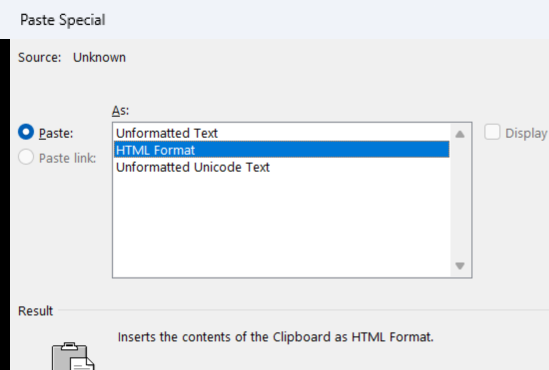

# Markdown → Outlook ✉️

**Because life's too short to fight Outlook's formatting.**

A single-file, zero-dependency static HTML tool that converts Markdown into Outlook-compatible HTML with inline styles. Just paste your markdown, hit copy, and paste it into Outlook looking like you spent way more time on it than you did.

## ✨ Features

- **Full Markdown support** — headers, tables, lists (ordered & unordered), blockquotes, bold, italic, strikethrough, links, inline code, code blocks, and horizontal rules
- **Syntax highlighting** — powered by [highlight.js](https://highlightjs.org/). Specify the language in your fenced code blocks (` ```python `, ` ```yaml `, etc.) and get real, colorized syntax in your emails
- **5 code themes** — GitHub Dark, One Dark, Nord, Dracula, and Monokai. Because your YAML deserves to look good
- **Customizable tables** — four table styles (clean, striped, bordered, minimal) with configurable header colors
- **Font & size control** — pick your body font (Aptos, Calibri, Arial…) and size. Code blocks always render in Consolas
- **Outlook-tested** — all HTML uses inline styles and table-based layouts that survive Outlook's Word rendering engine. Code blocks, blockquotes, and horizontal rules are all built with `<table>` elements because that's what Outlook respects
- **Works in Gmail too** — inline styles mean it pastes beautifully into Gmail and other email clients as well
- **Two copy modes** — "Copy for Outlook" (rich text for pasting) and "Copy HTML" (raw source)
- **Static & portable** — one HTML file, no build step, no server. Open it in your browser and go
- **Bilingual (EN/ES)** — auto-detects your browser language, with a one-click switcher. Defaults to English

## 🚀 Usage

1. Open `web/index.html` in your browser
2. Write or paste your Markdown on the left
3. Tweak options (table style, theme, font…) to your liking
4. Click **📋 Copy for Outlook**
5. In Outlook:
   - **Windows:** `Ctrl+Alt+V` → select **"HTML Format"** → OK
   - **Mac:** Edit menu → **Paste Special** → select **"HTML Format"** → OK

> **Why not just Ctrl+V?** Regular paste works for tables and basic structure, but Outlook's paste handler loves to strip fonts and some formatting. Paste Special → HTML Format tells Outlook to trust the HTML as-is, preserving fonts, syntax highlighting colors, and code block backgrounds.



## 📸 Preview

Hit the **Example** button in the tool to see a sample report with tables, code blocks (Python + YAML with syntax highlighting), lists, blockquotes, and more.

## 🛠 How it works

The tool has a custom Markdown parser that generates HTML with:

- **Inline styles on every element** — no external CSS, no classes. Outlook strips `<style>` blocks, so everything is baked into `style=""` attributes
- **Table-based layouts** for code blocks, blockquotes, and horizontal rules — Outlook's Word engine ignores `<div>`, `<pre>` backgrounds, and CSS borders, but it respects `<table>` with `bgcolor`
- **highlight.js** for syntax highlighting in the preview (CSS-based) and a parallel path that converts hljs class names into inline `style="color:..."` spans for the clipboard version

## 📄 License

MIT — do whatever you want with it.

## 👤 Author

[Jorge Martí](https://github.com/jorgemarti/)
